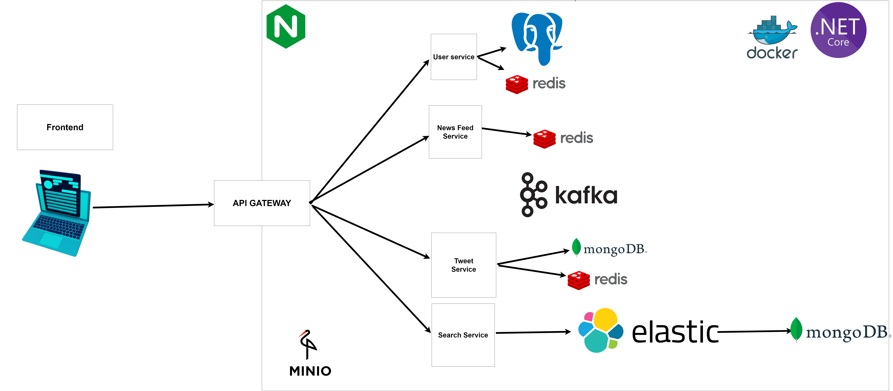

# О проекте

## Микроблог (твиттер по-русски)

Требуется реализовать прототип распределенной платформы для микроблогов

В качестве основной базы данных предлагается использовать MongoDB:

- сохранения сообщений
- сохранения и обновления аккаунтов пользователей (авторов сообщений)

Для отображения ленты и поиска сообщений предлагается использовать ElasticSearch:

- полнотекстовый поиск сообщений
- отображение сообщений за последний час/день

Для быстрого отображения информации о пользователях (логин/имя пользователя/...) предлагается использовать распределенный кэш.

При редактировании аккаунта пользователя, блокировать его в Hazelcast для предотвращения конфликта.

### **Предлагаемый план работ:**

**1. Обсудить и согласовать модель данных предметной области (UserAccount, Message)**

**2. Реализация**

- Cервис для работы с MongoDB для Message
- Cервис для работы с ElasticSearch
- Cервис для работы с MongoDB для UserAccount
- Реализация кэширования и блокировки UserAccount в Redis
- Реализация загрузки данных из stackoverflow в систему с использованием реализованных сервисов

**3. Интеграция**

- Загрузка полного объема данных в кластер (не менее нескольких миллионов сообщений)
- Функциональное тестирование и исправление ошибок
- Тест на отключение отдельных узлов и восстановление связи с узлом

# Архитектура

# Команда

Вартумян Валерий Давидович

Буреева Полина Сергеевна